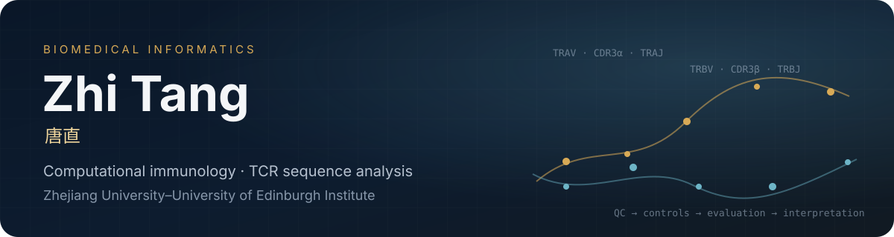
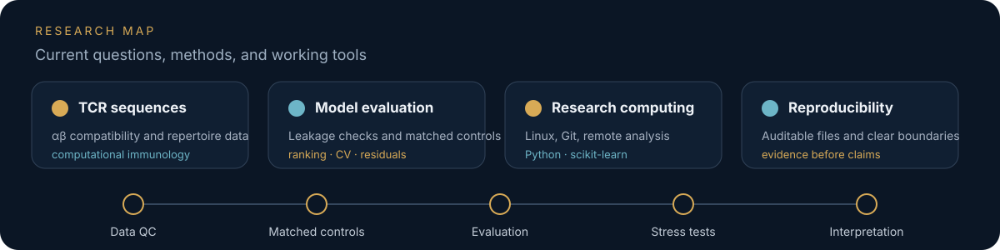

  

  
  
  
  

I am a Biomedical Informatics undergraduate at the Zhejiang University–University of Edinburgh Institute. My current research focuses on computational immunology, TCR sequence analysis, and reliable evaluation of machine-learning methods for biological data. Outside research, I build small software tools and maintain a long-term photography archive.

生物医学信息学本科生；目前主要做计算免疫学与 TCR 序列分析，同时持续进行软件开发与摄影。

<table>
  <tr>
    <td width="33%" valign="top">
      <b>🎓 Education</b>  
      ZJE Institute 
      Biomedical Informatics 
      Expected 2029
    </td>
    <td width="33%" valign="top">
      <b>🧬 Current research</b>  
      TCR α–β compatibility 
      Sequence representations 
      Leakage-aware evaluation
    </td>
    <td width="33%" valign="top">
      <b>🛠 Building & tools</b>  
      AI Lightroom 
      Python · Linux · Git 
      ESM2 · SCEPTR
    </td>
  </tr>
</table>

## Current build — AI Lightroom

  

**[AI Lightroom ↗](https://github.com/Garry-Tang-274/AI-Lightroom)** is a Windows desktop photo editor built around non-destructive traditional adjustments with optional natural-language AI colour-grading plans. Manual controls and AI providers share one editing state; the local renderer applies supported parameters, HSL, curves, masks, and watermark layers instead of redrawing or replacing the photograph.

The provider system currently supports local and cloud routes including JarvisArt Local GGUF, Gemini, OpenAI, Qwen / DashScope, DeepSeek text adjustments, and custom OpenAI-compatible APIs. Manual editing does not require an AI account.

这是最近持续开发的桌面摄影工具：传统参数调整负责真正修改像素，AI 负责可选的自然语言调色方案，不把照片生成式重绘成另一张图。

## Research

  

### TCR α–β pairing compatibility

My current project asks how much information related to TCR α–β compatibility is retained in frozen sequence representations. I work on sequence and metadata QC, matched negative sampling, within-individual candidate sets, ranking evaluation, cross-validation, residual analysis, and decoy-β comparisons.

I also contribute computational analysis planning for a National-Level Student Research Training Program involving paired TCR and NGS measurements.

  
  
  
  
  
  

## Selected public work

<table>
  <tr>
    <td width="33%" valign="top">
      <b><a href="https://github.com/Garry-Tang-274/bioinformatics-paper-reading-workflow">Bioinformatics Paper Reading Workflow ↗</a></b>  
      Templates and checklists for close reading, evidence extraction, and methodological review.  
      <code>bioinformatics</code> <code>workflow</code>
    </td>
    <td width="33%" valign="top">
      <b><a href="https://github.com/Garry-Tang-274/windows-remote-research-playbook">Windows Remote Research Playbook ↗</a></b>  
      Practical notes on SSH, VPN routing, Python environments, and remote research work.  
      <code>linux</code> <code>remote</code>
    </td>
    <td width="33%" valign="top">
      <b><a href="https://github.com/Garry-Tang-274/student-calendar-coordinator">Student Calendar Coordinator ↗</a></b>  
      A human-in-the-loop workflow for merging schedules, deadlines, email updates, and calendars.  
      <code>automation</code> <code>workflow</code>
    </td>
  </tr>
</table>

## Photography

  
   
  Qianjiang Century City · Hangzhou, 2026 · Nikon Z6 II · Updated edition

<table>
  <tr>
    <td width="50%"></td>
    <td width="50%"></td>
  </tr>
  <tr>
    <td align="center">Xianggong Mountain · Yangshuo, 2025</td>
    <td align="center">Gobi Road · Xinjiang, 2023</td>
  </tr>
  <tr>
    <td width="50%"></td>
    <td width="50%"></td>
  </tr>
  <tr>
    <td align="center">Rain Crossing · Chengdu, 2026</td>
    <td align="center">Heron in Rain · Chengdu, 2026</td>
  </tr>
</table>

  <a href="https://garry-tang-274.github.io/photography/"><b>View the full photography page →</b></a>

---

  <a href="https://garry-tang-274.github.io">Website</a> ·
  <a href="https://garry-tang-274.github.io/cv/">Academic CV</a> ·
  <a href="mailto:zhi.25@intl.zju.edu.cn">zhi.25@intl.zju.edu.cn</a> ·
  <a href="mailto:garrytang247514@gmail.com">garrytang247514@gmail.com</a>

